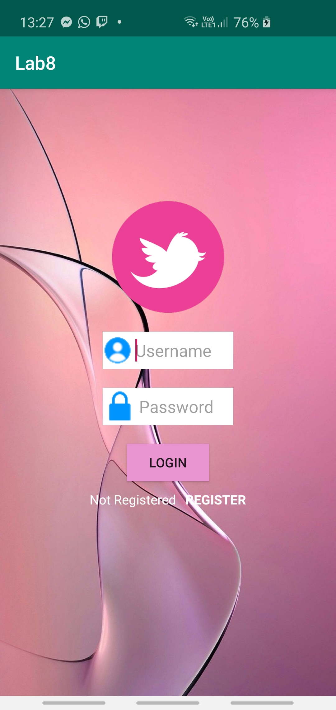
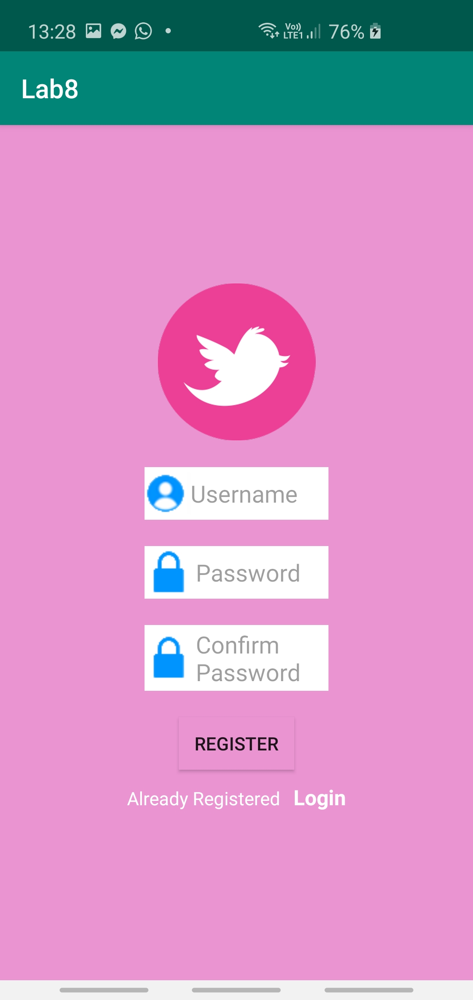

# DAPM-Lab-8

I have followed the tutorial for a Login and Registration app using SQLite from this link : https://www.youtube.com/watch?v=35nseBz0CKY with some modifications regarding the aspect of the app.

                                          
  

The project consists of
 - MainActivity and activity-main.xml -> the main login page with a login button, two textViews (the important one being textViewRegister) and two editTexts : for username and for password:
    - includes the DatabaseHelper class created to store the data from the registered user in the database ( mainly the username and password )
    - the Login button when clicked, it's programmed to either show that you have logged in successfully or to tell you that you are not registered therefore you have to register
    - the register textView, when clicked, sends you to the RegisterActivity class which includes the same elements as the MainActivity and one more EditText for the password registration
      - the password has to match with the confirmed password, otherwise there is a Toast which will show that the password is not matching
      - when everything matches, you will get a message saying you have registered and the Register button, when pressed, sends you back to the MainActivity page

HERE IS A GIF OF HOW THE APP WORKS:

                                                  
    

The app will store every registration into the database offered by SQLite, therefore when you close the app and reopen it, the username and password registered will work:

   
      
 
